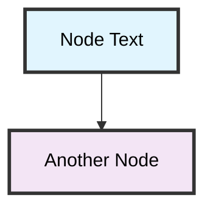

# CLAUDE.md - Spring Boot Labs

This file contains common commands and patterns for working with the Spring Boot lab projects. Use these commands when working with Claude Code or any development environment.

## Project Information

- **Spring Boot Version**: 3.5.3
- **Java Version**: 17+ (required)
- **Gradle Version**: 8.14.2
- **Package Structure**: `com.kousenit.*`

## Project Structure

```
spring-and-spring-boot/
├── demo/              # Basic Spring Boot web application
├── restclient/        # External API integration examples
├── persistence/       # Database access patterns
├── shopping/          # Enterprise shopping application (from advanced labs)
├── labs.md            # Comprehensive basic lab instructions
├── advanced-labs.md   # Enterprise development labs (UPDATED to match solution)
└── README.md          # Project overview and quick start
```

## Lab Instructions Philosophy

The lab instructions follow a **progressive implementation strategy**:
- **Basic Labs (labs.md)**: Foundation concepts
- **Advanced Labs (advanced-labs.md)**: Updated to match final implementation exactly
- **Copy-Paste Ready**: Students can reference solution code when needed
- **Step-by-Step Learning**: Progressive complexity building to enterprise patterns

## Key Decisions Made

### Modern Spring Boot Patterns
- **@MockitoBean**: Updated from deprecated @MockBean across all tests (Spring Boot 3.4+ modern approach)
- **Lombok Integration**: Consistent use of `@Getter`, `@RequiredArgsConstructor`, `@Slf4j` for cleaner code
- **YAML Configuration**: Single file with `---` profile separation
- **RFC 7807 ProblemDetail**: Standardized error responses
- **Profile-based Test Isolation**: Separate test database configuration
- **Functional Programming**: Modern Java idioms for cleaner, more maintainable code

### Test Isolation Strategy (@DirtiesContext)
- **Integration Test Design**: Uses `@DirtiesContext` for complete Spring context refresh
- **Database Constraint Testing**: Enables testing real constraint violations (duplicate SKU → HTTP 409)
- **Alternative Rejected**: `@Transactional` + `@Rollback(false)` causes Hibernate session conflicts
- **Educational Value**: Shows proper enterprise test isolation patterns
- **Modern Test Annotations**: `@MockitoBean` and `@Autowired Validator` replace legacy patterns

### Shopping Application Architecture
- **Progressive Entity Design**: Start simple, add validation in Lab 4
- **Database Indexes**: Performance optimization for SKU and name fields
- **Custom Repository Queries**: Sophisticated Spring Data JPA patterns
- **DTO Pattern**: Records for immutable request/response objects
- **Production-Ready Configuration**: Comprehensive application.yml with logging and monitoring
- **Exception Design**: Lombok-enhanced custom exceptions with proper field encapsulation
- **Service Layer**: Direct service classes (no interfaces) following modern Spring Boot conventions

## Common Commands

### Build Commands

```bash
# Build all projects from root
./gradlew build

# Build specific projects
cd demo && ./gradlew build
cd restclient && ./gradlew build  
cd persistence && ./gradlew build
cd shopping && ./gradlew build

# Clean and rebuild
./gradlew clean build

# Check for dependency updates
./gradlew dependencyUpdates
```

### Test Commands

```bash
# Run all tests
./gradlew test

# Run tests for specific project
cd demo && ./gradlew test
cd restclient && ./gradlew test
cd persistence && ./gradlew test
cd shopping && ./gradlew test

# Run tests with detailed output
./gradlew test --info

# Run specific test class
./gradlew test --tests HelloControllerTest

# Run tests matching pattern
./gradlew test --tests "*Json*"
```

### Application Commands

```bash
# Run demo application (port 8080)
cd demo && ./gradlew bootRun

# Run restclient examples
cd restclient && ./gradlew bootRun

# Run persistence application with H2 console
cd persistence && ./gradlew bootRun

# Run shopping application (enterprise example)
cd shopping && ./gradlew bootRun

# Run with specific profile
./gradlew bootRun --args='--spring.profiles.active=dev'
./gradlew bootRun --args='--spring.profiles.active=test'
./gradlew bootRun --args='--spring.profiles.active=prod'

# Run with multiple profiles
./gradlew bootRun --args='--spring.profiles.active=dev,debug'

# Run with JVM options
./gradlew bootRun --args='--server.port=8081'

# Run with environment variables
SPRING_PROFILES_ACTIVE=prod ./gradlew bootRun
```

### Development Commands

```bash
# Generate IDE files (IntelliJ)
./gradlew idea

# Generate IDE files (Eclipse)
./gradlew eclipse

# Check code style
./gradlew checkstyleMain checkstyleTest

# Create JAR files
./gradlew bootJar

# List all tasks
./gradlew tasks
```

## Testing Patterns

### Unit Testing with JUnit 5

```java
@Test
void shouldReturnGreeting() {
    // Given
    String name = "World";
    
    // When
    String result = service.greet(name);
    
    // Then
    assertEquals("Hello, World!", result);
}
```

### Modern Spring Boot Testing Patterns

#### Integration Testing with Database Constraints

```java
/**
 * Integration tests with proper test isolation strategy.
 * 
 * Testing Strategy:
 * - Uses @DirtiesContext to refresh the Spring context after each test method
 * - This ensures complete test isolation when testing database constraints
 * - @BeforeEach clears the database before each test for clean state
 * - Allows real database commits to test constraint violations (e.g., duplicate SKU)
 * 
 * Alternative approaches considered:
 * - @Transactional + @Rollback(false): Caused Hibernate session conflicts
 * - Manual cleanup only: Less robust isolation between tests
 */
@SpringBootTest
@AutoConfigureMockMvc
@ActiveProfiles("test")
@DirtiesContext(classMode = DirtiesContext.ClassMode.AFTER_EACH_TEST_METHOD)
class ShoppingApplicationIntegrationTest {
    
    @Autowired
    private MockMvc mockMvc;
    
    @Autowired
    private ProductRepository productRepository;
    
    @BeforeEach
    void setUp() {
        // Clear the database before each test
        productRepository.deleteAll();
    }
    
    @Test
    @DisplayName("Should handle duplicate SKU scenarios")
    void testDuplicateSkuIntegration() throws Exception {
        // Create first product
        Product existingProduct = new Product();
        existingProduct.setSku("DUP-123456");
        productRepository.save(existingProduct);
        
        // Try to create second product with same SKU
        ProductRequest duplicateRequest = new ProductRequest(
            "Duplicate Product", 
            new BigDecimal("149.99"), 
            "Another product", 
            5, 
            "DUP-123456", // Same SKU
            "duplicate@example.com"
        );
        
        mockMvc.perform(post("/api/v1/products")
                .contentType(MediaType.APPLICATION_JSON)
                .content(objectMapper.writeValueAsString(duplicateRequest)))
            .andExpect(status().isConflict())
            .andExpect(jsonPath("$.status").value(409))
            .andExpect(jsonPath("$.title").value("Duplicate SKU"));
    }
}
```

#### Service Layer Testing with Modern Annotations

```java
@SpringBootTest
@ActiveProfiles("test")
class ProductServiceTest {
    
    @MockitoBean
    private ProductRepository productRepository;
    
    @Autowired
    private ProductService productService;
    
    @Test
    @DisplayName("Should create product successfully")
    void testCreateProductSuccess() {
        // Given
        ProductRequest request = new ProductRequest(
            "Test Product", new BigDecimal("99.99"), 
            "Description", 10, "TST-123456", "test@example.com"
        );
        when(productRepository.save(any(Product.class))).thenReturn(savedProduct);
        
        // When
        ProductResponse result = productService.createProduct(request);
        
        // Then
        assertThat(result.name()).isEqualTo("Test Product");
        verify(productRepository).save(any(Product.class));
    }
}
```

#### Entity Validation Testing

```java
@SpringBootTest
@ActiveProfiles("test")
class ProductTest {
    
    @Autowired
    private Validator validator;
    
    @Test
    @DisplayName("Should fail validation when name is blank")
    void testInvalidProductBlankName() {
        Product product = createValidProduct();
        product.setName("");
        
        Set<ConstraintViolation<Product>> violations = validator.validate(product);
        
        assertThat(violations).hasSize(2); // Both @NotBlank and @Size
        assertThat(violations)
            .extracting(ConstraintViolation::getMessage)
            .containsExactlyInAnyOrder(
                "Product name is required",
                "Product name must be between 3 and 100 characters"
            );
    }
}
```

### MockMVC Testing

```java
@WebMvcTest(HelloController.class)
class HelloControllerTest {
    
    @Autowired
    private MockMvc mockMvc;
    
    @Test
    void shouldReturnHelloWorld() throws Exception {
        mockMvc.perform(get("/hello"))
                .andExpect(status().isOk())
                .andExpect(content().string(containsString("Hello, World!")));
    }
}
```

### Reactive Testing

```java
@Test
void shouldReturnUsersReactively() {
    service.getAllUsersAsync()
            .as(StepVerifier::create)
            .expectNextCount(10)
            .verifyComplete();
}
```

## Common Troubleshooting

### Build Issues

```bash
# Clear Gradle cache
rm -rf ~/.gradle/caches/

# Refresh dependencies
./gradlew build --refresh-dependencies

# Check Java version
java -version

# Check Gradle version
./gradlew --version
```

### Application Issues

```bash
# Check if port is in use
lsof -i :8080

# Kill process on port 8080
kill -9 $(lsof -ti:8080)

# Run with different port
./gradlew bootRun --args='--server.port=8081'
```

### Database Issues (H2)

```bash
# Access H2 Console
# URL: http://localhost:8080/h2-console
# JDBC URL: jdbc:h2:mem:testdb
# Username: sa
# Password: (empty)

# Reset database
./gradlew clean bootRun
```

## API Testing

### Shopping API Endpoints (When running shopping application)

```bash
# Get all products (paginated)
curl http://localhost:8080/api/v1/products

# Get product by ID
curl http://localhost:8080/api/v1/products/1

# Search products by name
curl "http://localhost:8080/api/v1/products/search?name=iPhone"

# Get products in price range
curl "http://localhost:8080/api/v1/products/price-range?minPrice=100&maxPrice=500"

# Get low stock products
curl "http://localhost:8080/api/v1/products/low-stock?threshold=10"

# Create a new product
curl -X POST http://localhost:8080/api/v1/products \
     -H "Content-Type: application/json" \
     -d '{
       "name": "New Product",
       "price": 99.99,
       "description": "A new product",
       "quantity": 10,
       "sku": "NEW-123456",
       "contactEmail": "contact@example.com"
     }'

# Update product
curl -X PUT http://localhost:8080/api/v1/products/1 \
     -H "Content-Type: application/json" \
     -d '{
       "name": "Updated Product",
       "price": 149.99,
       "description": "Updated description",
       "quantity": 20,
       "sku": "UPD-123456",
       "contactEmail": "updated@example.com"
     }'

# Update stock
curl -X PUT http://localhost:8080/api/v1/products/1/stock \
     -H "Content-Type: application/json" \
     -d '{"quantity": 50}'

# Reserve stock
curl -X POST http://localhost:8080/api/v1/products/1/reserve-stock \
     -H "Content-Type: application/json" \
     -d '{"quantity": 5}'

# Delete product
curl -X DELETE http://localhost:8080/api/v1/products/1
```

### JSON Placeholder API (No Auth Required)

```bash
# GET requests
curl https://jsonplaceholder.typicode.com/users
curl https://jsonplaceholder.typicode.com/users/1
curl https://jsonplaceholder.typicode.com/users/1/posts

# POST requests
curl -X POST https://jsonplaceholder.typicode.com/posts \
     -H "Content-Type: application/json" \
     -d '{"userId": 1, "title": "Test Post", "body": "This is a test post"}'

curl -X POST https://jsonplaceholder.typicode.com/users \
     -H "Content-Type: application/json" \
     -d '{"name": "John Doe", "email": "john@example.com"}'

# DELETE requests
curl -X DELETE https://jsonplaceholder.typicode.com/posts/1
curl -X DELETE https://jsonplaceholder.typicode.com/users/1
```

### NASA Open Data API

```bash
# Test astronauts in space
curl http://api.open-notify.org/astros.json
```

## Modern Java Features Examples

### Records (Java 17+)

```java
// DTO Pattern with Records
public record ProductRequest(
    String name,
    BigDecimal price,
    String description,
    Integer quantity,
    String sku,
    String contactEmail
) {}

public record ProductResponse(
    Long id,
    String name,
    BigDecimal price,
    String description,
    Integer quantity,
    String sku,
    String contactEmail,
    LocalDateTime createdAt,
    LocalDateTime updatedAt
) {}
```

### Lombok Patterns

```java
@Entity
@Table(name = "products")
@Getter
@NoArgsConstructor
@AllArgsConstructor
public class Product {
    // Fields with validation annotations
    @Id
    @GeneratedValue(strategy = GenerationType.IDENTITY)
    private Long id;
    
    @NotBlank(message = "Product name is required")
    private String name;
    // ... other fields
}

@Service
@RequiredArgsConstructor
@Slf4j
public class ProductService {
    private final ProductRepository productRepository;
    
    public ProductResponse createProduct(ProductRequest request) {
        log.info("Creating product with SKU: {}", request.sku());
        // Implementation...
    }
}
```

### Exception Handling with Lombok

```java
@Getter
public class ProductNotFoundException extends RuntimeException {
    private final Long productId;
    
    public ProductNotFoundException(String message) {
        super(message);
        this.productId = null;
    }
    
    public ProductNotFoundException(String message, Long productId) {
        super(message);
        this.productId = productId;
    }
}
```

### Text Blocks (Java 17+)

```java
String sql = """
    SELECT id, name, email 
    FROM users 
    WHERE active = true
    ORDER BY name
    """;
```

### RestClient (Spring Boot 3.2+)

```java
List<User> users = restClient.get()
    .uri("/users")
    .retrieve()
    .body(new ParameterizedTypeReference<List<User>>() {});
```

### JdbcClient (Spring Boot 3.2+)

```java
Optional<User> user = jdbcClient
    .sql("SELECT * FROM users WHERE id = :id")
    .param("id", userId)
    .query(User.class)
    .optional();
```

## Useful Development URLs

When applications are running:

- **Demo App**: http://localhost:8080
- **H2 Console**: http://localhost:8080/h2-console
- **Actuator Health**: http://localhost:8080/actuator/health
- **Actuator Info**: http://localhost:8080/actuator/info

## IDE Configuration

### IntelliJ IDEA

1. Import as Gradle project
2. Enable annotation processing
3. Set Project SDK to Java 17+
4. Enable Spring Boot features

### VS Code

Required extensions:
- Extension Pack for Java
- Spring Boot Extension Pack
- Gradle for Java

## Performance Tips

```bash
# Use Gradle daemon (faster builds)
echo "org.gradle.daemon=true" >> ~/.gradle/gradle.properties

# Use parallel builds
echo "org.gradle.parallel=true" >> ~/.gradle/gradle.properties

# Increase memory for builds
echo "org.gradle.jvmargs=-Xmx2g -XX:MaxPermSize=512m" >> ~/.gradle/gradle.properties
```

## Presentation Design Patterns

### Mermaid Diagram Best Practices

For optimal readability in both light and dark modes, use this pattern for all Mermaid diagrams:



**Key elements for readability:**
- **No `<b>` tags** - they don't render reliably in Mermaid
- **Explicit black text color** (`color:#000`) for contrast in both themes
- **Thick borders** (`stroke-width:3px`) for better definition
- **Dark border color** (`stroke:#333`) works well with all backgrounds
- **Exception**: White text (`color:#fff`) on very dark backgrounds like Spring green (`#6db33f`)

## Security Notes

- Never commit API keys or secrets
- Use environment variables for configuration
- Keep dependencies updated
- Review security advisories regularly