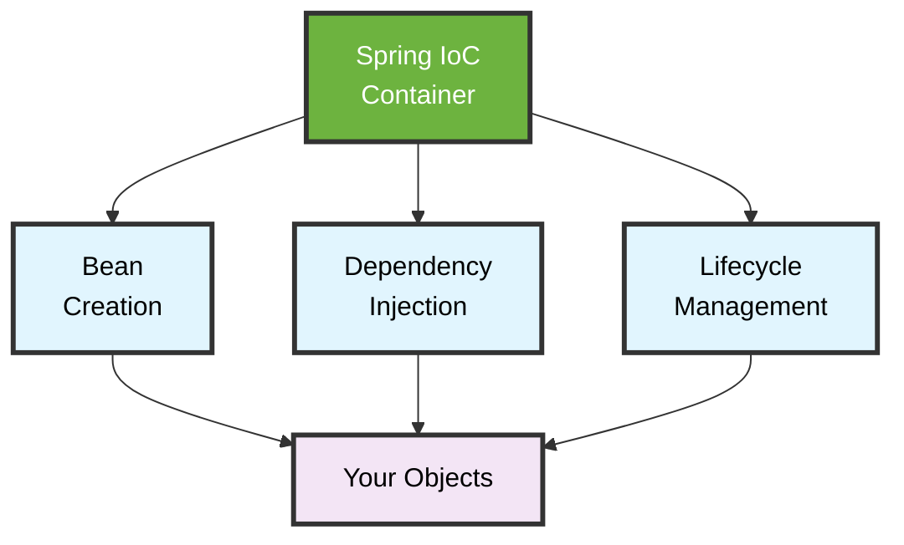
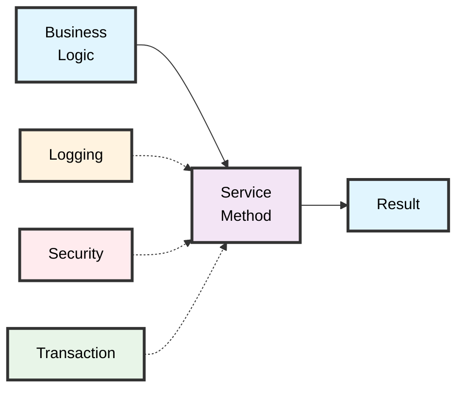
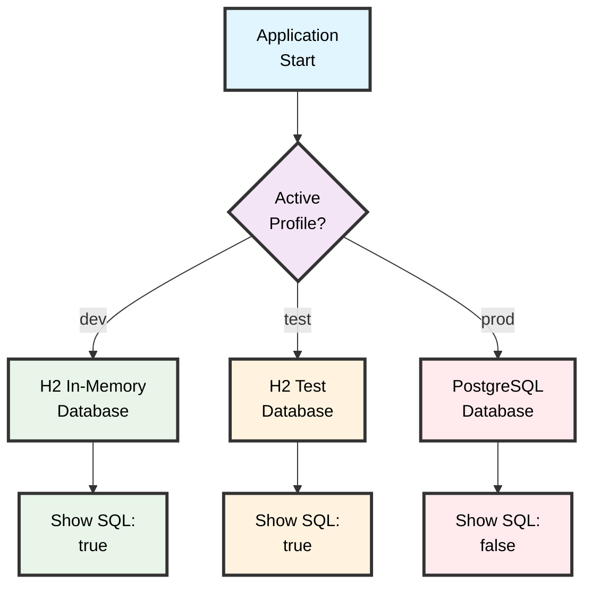
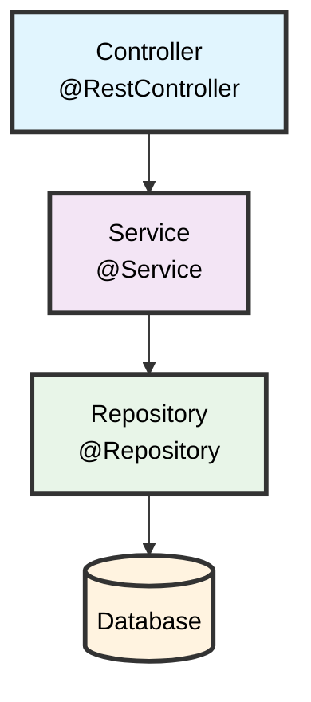
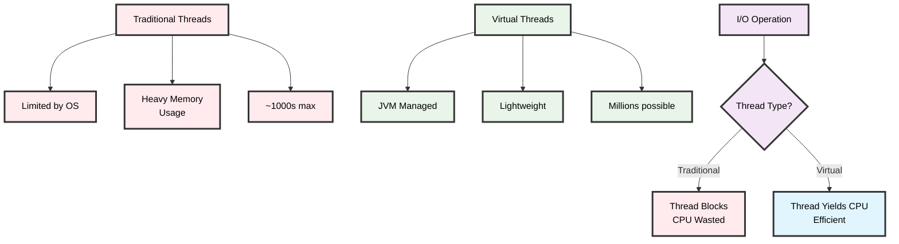

# Core Spring & Spring Boot

<div class="pt-12">
  <span class="text-xl opacity-75">
    A comprehensive guide to modern Java development
  </span>
</div>

---

# Contact Info

Ken Kousen<br>
Kousen IT, Inc.

- ken.kousen@kousenit.com
- http://www.kousenit.com
- http://kousenit.org (blog)
- Social Media:
  - [@kenkousen](https://twitter.com/kenkousen) (Twitter)
  - [@kousenit.com](https://bsky.app/profile/kousenit.com) (Bluesky)
  - [https://www.linkedin.com/in/kenkousen/](https://www.linkedin.com/in/kenkousen/) (LinkedIn)
- *Tales from the jar side* (free newsletter)
  - https://kenkousen.substack.com
  - https://youtube.com/@talesfromthejarside

---

# Prerequisites

<v-clicks>

- **Java**: Version 17 or higher (Spring Boot 3.x requirement)
- **Build Tools**: Gradle or Maven familiarity
- **IDE**: IntelliJ IDEA, VS Code, or Eclipse with Spring support
- **Basic Knowledge**:
  - Java programming fundamentals
  - Basic understanding of web concepts (HTTP, REST)
  - Some familiarity with SQL databases
- **Not Required**: Previous Spring experience (we'll cover everything!)

</v-clicks>

---
layout: two-cols
---

# Table of Contents

<v-clicks>

- **Fundamentals**
  - Spring Framework basics
  - Dependency Injection & IoC
  - Spring Boot introduction
- **Web Development**
  - Spring MVC
  - REST controllers
  - Testing web endpoints
- **Data Access**
  - JdbcClient
  - Spring Data JPA
  - Derived queries

</v-clicks>

::right::

<v-clicks>

- **Advanced Topics**
  - Aspect-Oriented Programming
  - Configuration & Profiles
  - Exception handling
  - Validation
  - Spring Boot Actuator
- **Best Practices**
  - Layered architecture
  - Testing strategies
  - When to use what
- **Modern Features** (3.x+)

</v-clicks>

---

# Course Overview

<v-clicks>

- **Core Concepts**: Dependency Injection, AOP, Spring Application Context.
- **Spring Boot**: Starters, Auto-Configuration, Executable JARs.
- **Web Development**: Spring MVC, `@RestController`, Thymeleaf.
- **Data Access**: `JdbcTemplate`, `JdbcClient`, Spring Data JPA.
- **Client-Side REST**: `RestClient`, `WebClient`, HTTP Interfaces.
- **Advanced Topics**: Validation, Exception Handling, Profiles.

</v-clicks>

---
layout: section
---

# Spring Framework Fundamentals

---

# What is Spring?

<div class="grid grid-cols-2 gap-8">
<div>

<v-clicks>

- **Application framework** for Java
- **Inversion of Control (IoC)** container
- **Core feature**: Dependency Injection (DI)
- **Result**: Loosely coupled, testable code

</v-clicks>

</div>
<div>



</div>
</div>

---

# The Application Context

<v-clicks>

- **Heart** of a Spring application
- **Container** that holds all beans
- **Manages** instantiation and configuration
- **Registry** of application objects

</v-clicks>

---

# Defining Beans

<v-clicks>

- **`@Component`**: The most generic Spring annotation. It marks a class as a bean to be managed by the `ApplicationContext`.
- **Stereotype Annotations**: More specific versions of `@Component` for different layers.
  - **`@Service`**: For business logic (e.g., `ProductService`).
  - **`@Repository`**: For data access objects (e.g., `ProductRepository`).
  - **`@Controller` / `@RestController`**: For the web layer.
- **`@Configuration` and `@Bean`**: For Java-based configuration.

</v-clicks>

---
layout: section
---

# Introduction to Spring Boot

---

# What is Spring Boot?

<v-clicks>

- **Opinionated** Spring platform
- **Fast** application creation  
- **Production-ready** out of the box
- **Auto-configuration** and starters
- **Embedded servers** included

</v-clicks>

---

# Key Features of Spring Boot

<v-clicks>

- **Starters**: Pre-packaged dependency descriptors to simplify your build configuration.
  - `spring-boot-starter-web`: For building web apps, including RESTful applications, using Spring MVC. Includes Tomcat by default.
  - `spring-boot-starter-data-jpa`: For using Spring Data JPA with Hibernate.
- **Auto-configuration**: Attempts to automatically configure your Spring application based on the JAR dependencies you have added.
  - If `h2.jar` is on your classpath, it auto-configures an in-memory H2 database.
- **Executable JARs**: Creates self-contained, runnable JAR files with an embedded server (Tomcat, Jetty, or Undertow).
  - `java -jar my-app.jar`

</v-clicks>

---
layout: section
---

# Building Web Applications

---

# Lab: Creating a Web App

<v-clicks>

- **Goal**: Build a simple "Hello, World" web application.
- **Spring Initializr**: Use [start.spring.io](http://start.spring.io) to bootstrap the project.
- **Dependencies**:
  - `Spring Web`: Provides Spring MVC and an embedded Tomcat server.
  - `Thymeleaf`: A modern server-side Java template engine for creating the view.
- We will create a `HelloController` to handle requests and a `welcome.html` template to render the response.

</v-clicks>

---

# Spring MVC: The `@Controller`

A traditional `@Controller` is used to serve web pages. It returns a `String` that is the logical name of the view to be rendered.

```java
@Controller
public class HelloController {

    @GetMapping("/hello")
    public String sayHello(
            @RequestParam(defaultValue = "World") String name,
            Model model) {
        // Add the 'name' to the model to make it available in the view
        model.addAttribute("user", name);
        
        // Return the view name
        return "welcome";
    }
}
```
<v-clicks>

- `@GetMapping("/hello")`: Maps HTTP GET requests for `/hello` to this method.
- `@RequestParam`: Injects the `name` query parameter.
- `Model`: A container for data that you want to pass to the view.

</v-clicks>

---

# The View: Thymeleaf

Thymeleaf templates are placed in `src/main/resources/templates`. Spring Boot auto-configures Thymeleaf to find them.

```html
<!-- src/main/resources/templates/welcome.html -->
<!DOCTYPE HTML>
<html xmlns:th="http://www.thymeleaf.org">
<head>
    <title>Hello, World!</title>
</head>
<body>
    <!-- 'th:text' replaces the content of this tag -->
    <h2 th:text="'Hello, ' + ${user} + '!'">
      Static text as a placeholder.
    </h2>
</body>
</html>
```
<v-clicks>

- `th:text`: A Thymeleaf attribute that evaluates the expression and sets the result as the body of the tag.
- `${user}`: Accesses the `user` attribute we added to the `Model` in the controller.

</v-clicks>

---

# REST Controllers

For building APIs that return data (like JSON or XML) instead of HTML views, we use `@RestController`.

```java
@RestController
public class HelloRestController {

    // A simple record to act as our Data Transfer Object (DTO)
    public record Greeting(String message) {}

    @GetMapping("/rest")
    public Greeting greet(@RequestParam(defaultValue = "World") String name) {
        return new Greeting("Hello, %s!".formatted(name));
    }
}
```
<v-clicks>

- `@RestController` = `@Controller` + `@ResponseBody`.
- `@ResponseBody` tells Spring to serialize the returned object into the response body.
- Spring Boot's `spring-boot-starter-web` includes the Jackson library, which automatically handles the conversion to JSON.

</v-clicks>

---

# Testing Web Endpoints

<v-clicks>

- **`@WebMvcTest`**: A slice test that focuses only on the web layer. It doesn't load the full application context, making it faster. It auto-configures `MockMvc`.
- **`MockMvc`**: Allows you to send HTTP requests to your controllers and assert the responses without needing a running server.

```java
@WebMvcTest(HelloController.class)
public class HelloControllerMockMVCTest {
    @Autowired
    private MockMvc mvc;

    @Test
    void testHelloWithName() throws Exception {
        mvc.perform(get("/hello").param("name", "Dolly"))
           .andExpect(status().isOk())
           .andExpect(view().name("welcome"))
           .andExpect(model().attribute("user", "Dolly"));
    }
}
```

</v-clicks>

---
layout: section
---

# Consuming REST APIs

---

# REST Clients in Spring

<v-clicks>

- **`RestTemplate`**: The original, synchronous client. Now in maintenance mode.
- **`WebClient`**: The modern, asynchronous, non-blocking client. Part of the reactive stack.
- **`RestClient`** (Spring 6.1+): A modern, synchronous client with a fluent API inspired by `WebClient`. The recommended choice for new synchronous applications.
- **HTTP Interfaces** (Spring 6+): A declarative, annotation-based way to create clients.

</v-clicks>

---

# Using `RestClient`

`RestClient` provides a modern, fluent API for synchronous HTTP calls.

```java
// In a service or component
private final RestClient restClient;

public AstroService() {
    // Create a client instance, often configured as a bean
    this.restClient = RestClient.create("http://api.open-notify.org");
}

public AstroResponse getAstroData() {
    return restClient.get()
            .uri("/astros.json")
            .accept(MediaType.APPLICATION_JSON)
            .retrieve() // Execute the request
            .body(AstroResponse.class); // Deserialize the body
}
```
<v-clicks>

- The API is chainable and easy to read.
- `retrieve()` performs the request and starts the process of handling the response.
- `body()` automatically deserializes the JSON response into your specified class.

</v-clicks>

---

# HTTP Interfaces: Declarative Clients

This is the cleanest way to define a client. You just write an interface.

1.  **Define the Interface**:
```java
public interface AstroInterface {
    @GetExchange("/astros.json")
    AstroResponse getAstroResponse();
}
```
---

# HTTP Interfaces (cont.)

2.  **Create a Factory Bean**: In a `@Configuration` class, tell Spring how to create an implementation of your interface.
```java
@Bean
public AstroInterface astroInterface() {
    WebClient client = WebClient.create("http://api.open-notify.org");
    HttpServiceProxyFactory factory = HttpServiceProxyFactory
            .builder(WebClientAdapter.forClient(client)).build();
    return factory.createClient(AstroInterface.class);
}
```
<v-clicks>

3.  **Inject and Use**:
```java
@Autowired
private AstroInterface astroClient;

// Now you can just call the method!
AstroResponse response = astroClient.getAstroResponse();
```
</v-clicks>

---

# REST Client Choice: RestClient vs WebClient

<v-clicks>

- **RestClient** (Recommended for most apps)
  - Synchronous applications
  - Simple request/response patterns
  - Modern fluent API

- **WebClient**
  - Reactive applications
  - Streaming data
  - Non-blocking I/O requirements

</v-clicks>

---

# REST Client Choice: HTTP Interfaces

<v-clicks>

- **HTTP Interfaces** (Best for multiple endpoints)
  - Multiple endpoints from same API
  - Type-safe client definitions
  - Minimal boilerplate code

## Quick decision guide:
- **Single API calls** → RestClient
- **Reactive/streaming** → WebClient  
- **Multiple endpoints** → HTTP Interfaces

</v-clicks>

---
layout: section
---

# Database Access with Spring

---

# Data Persistence Layers

Spring provides multiple levels of abstraction for working with databases.

<v-clicks>

1.  **JDBC**: The lowest level. Verbose and error-prone.
2.  **`JdbcTemplate` / `JdbcClient`**: Spring's wrappers that eliminate boilerplate code (connection management, exception handling). You still write the SQL.
3.  **JPA / ORM**: Object-Relational Mapping (e.g., with Hibernate). You work with Java objects (`@Entity`), and the ORM translates that into SQL.
4.  **Spring Data JPA**: The highest level of abstraction. Eliminates almost all DAO implementation code by providing repository interfaces.

</v-clicks>

---

# `JdbcClient`: The Modern Choice

`JdbcClient` offers a fluent API for executing SQL queries.

```java
@Repository
public class JdbcClientOfficerDAO implements OfficerDAO {
    private final JdbcClient jdbcClient;

    // ... constructor ...

    @Override
    public Optional<Officer> findById(Integer id) {
        return jdbcClient.sql("SELECT * FROM officers WHERE id = :id")
                .param("id", id) // Named parameter
                .query(this::mapRowToOfficer) // RowMapper
                .optional(); // Returns Optional<Officer>
    }
    
    // ...
}
```
<v-clicks>

- **Fluent API**: `sql().param().query().optional()` is readable and clear.
- **Named Parameters**: `:id` is less error-prone than `?`.
- **Built-in `optional()`**: Directly returns an `Optional`, simplifying code that handles "not found" cases.

</v-clicks>

---

# Spring Data JPA: The Magic

Spring Data JPA takes abstraction to the next level. You only need to define an interface.

1.  **The `@Entity`**:
```java
@Entity
@Table(name = "officers")
public class Officer {
    @Id @GeneratedValue
    private Integer id;
    // ... fields, getters, setters
}
```
<v-clicks>

2.  **The Repository Interface**:
```java
public interface OfficerRepository extends JpaRepository<Officer, Integer> {
    // That's it! You get save, findById, findAll, delete, etc. for free.
}
```
</v-clicks>
<v-clicks>

- By extending `JpaRepository`, your interface inherits a full set of CRUD methods.
- Spring Data analyzes the interface at runtime and provides the implementation automatically.

</v-clicks>

---

# Derived Queries

Spring Data JPA can create queries for you based on the method names in your repository interface.

```java
public interface OfficerRepository extends JpaRepository<Officer, Integer> {

    // SELECT o FROM Officer o WHERE o.rank = ?1
    List<Officer> findByRank(Rank rank);

    // SELECT o FROM Officer o WHERE o.lastName LIKE ?1
    List<Officer> findByLastNameContainingIgnoreCase(String lastName);

    // SELECT o FROM Officer o WHERE o.rank = ?1 AND o.lastName = ?2
    List<Officer> findByRankAndLastName(Rank rank, String lastName);
}
```
<v-clicks>

- The method name is parsed into a query.
- Keywords like `FindBy`, `And`, `Or`, `Containing`, `IgnoreCase` are used to build the `WHERE` clause.
- This is a powerful feature that eliminates the need to write JPQL for many common queries.

</v-clicks>

---
layout: image-right
image: https://images.unsplash.com/photo-1544383835-bda2bc66a55d?ixlib=rb-4.0.3&auto=format&fit=crop&w=1920&q=80
---

# Data Access Choice: JdbcClient vs JPA

<v-clicks>

- **JdbcClient**
  - Complex SQL queries
  - Performance-critical operations
  - Full control over SQL

- **Spring Data JPA**
  - CRUD-heavy applications
  - Rapid development
  - Complex domain models

</v-clicks>

---

# Data Access: The Mixed Approach

<v-clicks>

## Best of both worlds strategy:

- **Use JPA for standard CRUD**
  - Quick development for basic operations
  - Automatic query generation
  
- **Add custom JdbcClient for complex queries**
  - Performance-critical operations
  - Complex joins and aggregations

## Result: Pragmatic, flexible data layer

</v-clicks>

---
layout: section
---

# Aspect-Oriented Programming

---

# AOP: Why Learn This?

<v-clicks>

- **This section is optional**  
  But helps understand what Spring does under the hood

- **Most developers don't write aspects**  
  But it's not difficult when needed

- **A good IDE is essential**  
  Shows where and when aspects are applied

## Common Spring-provided aspects:
- `@Transactional` - Transaction management
- `@Cacheable` - Method caching
- `@Async` - Asynchronous execution

</v-clicks>

---

# What is AOP?

<div class="grid grid-cols-2 gap-8">
<div>

<v-clicks>

- **Cross-cutting concerns**: Logging, security, transactions
- **Aspects**: Modular units of functionality  
- **Join Points**: Method execution points (Spring only)
- **Pointcuts**: Select where to apply advice
- **Advice**: Code that runs at join points

</v-clicks>

</div>
<div>



</div>
</div>

---

# Spring AOP Details

<v-clicks>

## Important Limitations:
- **Method boundaries only**  
  Spring aspects work at method calls, not field access
- **Spring-managed beans only**  
  Must be `@Component`, `@Service`, etc.

## Based on AspectJ:
- Spring uses a **subset** of AspectJ functionality
- **Full documentation**: https://eclipse.org/aspectj
- Spring uses **proxy-based** AOP (not bytecode weaving)

</v-clicks>

---

# Types of Advice

<v-clicks>

1. **@Before**: Runs before the method execution
2. **@After**: Runs after the method (finally block)
3. **@AfterReturning**: Runs after successful method execution
4. **@AfterThrowing**: Runs if method throws an exception
5. **@Around**: Wraps the method execution (most powerful)

</v-clicks>

---

# AOP Example: Logging

```java
@Component
@Aspect
public class LoggingAspect {
    private final Logger logger = LoggerFactory.getLogger(LoggingAspect.class);

    @Before("execution(* com.kousenit.demo.controllers.*.*(..))")
    public void logMethodCalls(JoinPoint joinPoint) {
        logger.info("Entering method: {}", joinPoint.getSignature());
        logger.info("with args: {}", Arrays.toString(joinPoint.getArgs()));
    }

    @Around("execution(* com.kousenit.demo.controllers.*.*(..))")
    public Object measureExecutionTime(ProceedingJoinPoint joinPoint) throws Throwable {
        long startTime = System.nanoTime();
        Object result = joinPoint.proceed();
        long duration = (System.nanoTime() - startTime) / 1_000_000;
        logger.info("Method {} executed in {} ms", 
                   joinPoint.getSignature().getName(), duration);
        return result;
    }
}
```

---

# Custom Annotations with AOP

<v-clicks>

1. **Define the annotation**:
```java
@Target(ElementType.METHOD)
@Retention(RetentionPolicy.RUNTIME)
public @interface Timed {
    String description() default "";
}
```

2. **Create aspect for the annotation**:
```java
@Around("@annotation(timed)")
public Object timeAnnotatedMethods(ProceedingJoinPoint joinPoint, 
                                 Timed timed) throws Throwable {
    // Timing logic here
}
```

3. **Use it**:
```java
@Timed(description = "Processing user request")
public String processRequest() { ... }
```

</v-clicks>

---
layout: section
---

# Configuration & Profiles

---

# Spring Configuration

<v-clicks>

- **application.properties** / **application.yml**: External configuration
- **@Value**: Inject individual properties
- **@ConfigurationProperties**: Type-safe configuration binding
- **Environment abstraction**: Programmatic access to properties

```yaml
# application.yml
server:
  port: 8080
  
app:
  name: My Spring Boot App
  features:
    enable-cache: true
    max-connections: 100
```

</v-clicks>

---

# Configuration with @Value

<v-clicks>

```java
@Component
public class MyService {
    @Value("${app.name}")
    private String appName;
    
    @Value("${app.features.max-connections:50}") // with default
    private int maxConnections;
    
    @Value("#{systemProperties['user.home']}") // SpEL example
    private String userHome;
}
```

**Note**: Spring Expression Language (SpEL) with `#{}` allows complex expressions - details beyond this course

</v-clicks>

---

# Type-Safe Configuration

<v-clicks>

## @ConfigurationProperties
```java
@ConfigurationProperties(prefix = "app")
@Component
public class AppProperties {
    private String name;
    private Features features;
    // getters/setters or use records
}
```

- **Type-safe** binding of properties
- **Validation** support with `@Valid`
- **IDE support** for auto-completion

</v-clicks>

---

# Spring Profiles

<v-clicks>

- **Purpose**: Different configurations for different environments
- **Common profiles**: `dev`, `test`, `prod`
- **Properties files**: Use `application-{profile}.properties`
- **YAML files**: Use `---` separator in single file

</v-clicks>

---

# YAML Profile Example

<div class="grid grid-cols-2 gap-4">
<div>

```yaml
# application.yml - all profiles in one file
spring:
  profiles:
    active: dev  # default profile
---
spring:
  config:
    activate:
      on-profile: dev
  datasource:
    url: jdbc:h2:mem:devdb
  jpa:
    show-sql: true
---
spring:
  config:
    activate:
      on-profile: prod
  datasource:
    url: jdbc:postgresql://prod-server/myapp
  jpa:
    show-sql: false
```

</div>
<div>



</div>
</div>

---

# Activating Profiles

## Multiple ways to activate:

<v-clicks>

1. **Command line**: `java -jar app.jar --spring.profiles.active=prod`

2. **Environment variable**: `SPRING_PROFILES_ACTIVE=prod`

3. **application.yml**: 
```yaml
spring:
  profiles:
    active: dev
```

4. **In tests**: `@ActiveProfiles("test")`

</v-clicks>

<v-clicks>

## Profile-specific beans:
```java
@Component
@Profile("dev")
public class DevDataInitializer { ... }
```

</v-clicks>

---
layout: section
---

# Advanced Topics

---

# Layered Architecture

<div class="grid grid-cols-2 gap-8">
<div class="flex justify-center">



</div>
<div>

- **Controller Layer**  
  HTTP endpoints, web requests

- **Service Layer**  
  Business logic, transactions

- **Repository/DAO Layer**  
  Data access, domain models

**Result**: Easier to maintain, test, and evolve

</div>
</div>

---

# Bean Validation Annotations

<v-clicks>

Spring Boot supports Bean Validation API (JSR 380):

```java
public record ProductRequest(
    @NotBlank(message = "Product name is required")
    @Size(min = 3, max = 100)
    String name,

    @NotNull @DecimalMin("0.01")
    BigDecimal price
) {}
```

Add validation annotations to DTOs or Entities

</v-clicks>

---

# Enabling Validation

<v-clicks>

Use `@Valid` annotation in your controller:

```java
@PostMapping
public ResponseEntity<ProductResponse> createProduct(
        @Valid @RequestBody ProductRequest request) {
    // ...
}
```

**What happens on failure:**
- Spring throws `MethodArgumentNotValidException`
- Can be handled globally with `@RestControllerAdvice`

</v-clicks>

---

# Global Exception Handling

`@RestControllerAdvice` allows you to consolidate your exception handling logic in a single place.

```java
@RestControllerAdvice
public class GlobalExceptionHandler {

    @ExceptionHandler(ProductNotFoundException.class)
    @ResponseStatus(HttpStatus.NOT_FOUND)
    public ProblemDetail handleProductNotFoundException(ProductNotFoundException e) {
        ProblemDetail problemDetail = ProblemDetail.forStatusAndDetail(
            HttpStatus.NOT_FOUND, e.getMessage());
        problemDetail.setTitle("Product Not Found");
        return problemDetail;
    }
}
```

---

# Global Exception Handling (cont.)

```java
@RestControllerAdvice
public class GlobalExceptionHandler {
    // ... previous handler

    @ExceptionHandler(MethodArgumentNotValidException.class)
    @ResponseStatus(HttpStatus.BAD_REQUEST)
    public ProblemDetail handleValidationExceptions(MethodArgumentNotValidException ex) {
        // Logic to format validation errors
        // ...
        return ProblemDetail.forStatusAndDetail(HttpStatus.BAD_REQUEST, "Invalid data");
    }
}
```
<v-clicks>

- This keeps your controller code clean of try-catch blocks.
- It ensures consistent error responses across your entire API.
- `ProblemDetail` (RFC 7807) is a standard format for error responses.

</v-clicks>

---
layout: section
---

# Testing Strategies

---

# Spring Boot Slice Tests

<v-clicks>

- **@SpringBootTest**: Full application context (integration tests)
- **@WebMvcTest**: Only web layer (controllers)
- **@DataJpaTest**: Only JPA repositories
- **@JdbcTest**: Only JDBC operations
- **@JsonTest**: JSON serialization/deserialization
- **@RestClientTest**: REST client testing

Each slice loads only the relevant parts of the application, making tests faster.

</v-clicks>

---

# Unit Testing Best Practices

<v-clicks>

```java
@SpringBootTest
class ProductServiceTest {
    @MockitoBean
    private ProductRepository repository;
    
    @Autowired
    private ProductService service;
    
    @Test
    void shouldCalculateDiscount() {
        // Spring-managed unit tests
    }
}
```

- **Spring-aware** mocking with `@MockitoBean`
- **Dependency injection** still works
- **Mock external services** and repositories

</v-clicks>

---

# Integration Testing Best Practices

<v-clicks>

```java
@SpringBootTest
@AutoConfigureMockMvc
class ProductIntegrationTest {
    @Autowired private MockMvc mockMvc;
    
    @Test
    void shouldCreateProduct() throws Exception {
        // Test full request/response cycle
    }
}
```

- **Full Spring context** loaded
- **End-to-end testing** of request/response
- **Real component interaction**

</v-clicks>

---

# Test Data Management

<v-clicks>

## Strategies for test data:

1. **@Sql**: Execute SQL scripts before tests
```java
@Test
@Sql("/test-data.sql")
void shouldFindProducts() { ... }
```

2. **@DataJpaTest with TestEntityManager**:
```java
@Autowired
private TestEntityManager entityManager;
```

3. **Test Fixtures**: Reusable test data builders
```java
public class ProductFixtures {
    public static Product validProduct() {
        return new Product("Test", BigDecimal.TEN);
    }
}
```

</v-clicks>

---
layout: section
---

# Spring Boot Actuator

---

# What is the Spring Boot Actuator?

<v-clicks>

- **Production-ready features** out of the box
- **Endpoints** for monitoring and management
- **Metrics** collection and export
- **Health checks** for your application and dependencies
- **Application info** and environment details

```groovy
implementation 'org.springframework.boot:spring-boot-starter-actuator'
```

</v-clicks>

---

# Essential Actuator Endpoints

<v-clicks>

| Endpoint | Description |
|----------|-------------|
| `/actuator/health` | Application health status |
| `/actuator/info` | Application information |
| `/actuator/metrics` | Application metrics |
| `/actuator/env` | Environment properties |

</v-clicks>

---

# More Actuator Endpoints & Configuration

<v-clicks>

| Endpoint | Description |
|----------|-------------|
| `/actuator/loggers` | View and modify log levels |
| `/actuator/httptrace` | HTTP request traces |

```yaml
# Enable endpoints in application.yml
management:
  endpoints:
    web:
      exposure:
        include: health,info,metrics
```

</v-clicks>

---

# Custom Health Indicators

```java
@Component
public class DatabaseHealthIndicator implements HealthIndicator {
    
    @Autowired
    private DataSource dataSource;
    
    @Override
    public Health health() {
        try (Connection conn = dataSource.getConnection()) {
            if (conn.isValid(1)) {
                return Health.up()
                    .withDetail("database", "Available")
                    .build();
            }
        } catch (SQLException e) {
            return Health.down()
                .withDetail("error", e.getMessage())
                .build();
        }
        return Health.down().build();
    }
}
```

---
layout: section
---

# Modern Spring Boot 3+ Features

---

# Spring Boot 3.x Highlights

<v-clicks>

- **Java 17+ Baseline**: Modern Java features (records, text blocks, pattern matching)
- **Jakarta EE 9+**: Package namespace change from `javax.*` to `jakarta.*`
- **Native Compilation**: GraalVM native image support
- **Observability**: Micrometer observation API
- **Problem Details**: RFC 7807 support built-in
- **Improved Docker Support**: Paketo buildpacks, layered JARs

</v-clicks>

---

# Virtual Threads (Java 21+)

<div class="grid grid-cols-2 gap-8 mb-8">
<div>

## Enable with one property:
```yaml
spring:
  threads:
    virtual:
      enabled: true
```

</div>
<div>

## Key benefits:
- Lightweight threads (can have millions)
- No code changes required!
- Better resource utilization

</div>
</div>



---

# When to Use Virtual Threads

<v-clicks>

## Perfect for:
- **I/O-bound applications**
- **High-concurrency scenarios** 
- **Blocking operations**

## How they work:
- Traditional threads are expensive (heavy OS threads)
- Virtual threads are cheap (managed by JVM)
- Automatically yield during I/O operations

</v-clicks>

---

# GraalVM Native Images

<v-clicks>

## Build native executables:
```bash
./gradlew nativeCompile
```

## Advantages:
- **Fast startup**: Milliseconds instead of seconds
- **Lower memory**: Reduced footprint
- **Instant peak performance**: No JVM warmup

## Trade-offs:
- Longer build times
- Limited reflection
- Some libraries need hints

</v-clicks>

---

# Observability with Micrometer

<v-clicks>

```java
// Automatic observation of methods
@Observed(name = "user.service")
@Service
public class UserService {
    
    @Observed(name = "find.user")
    public User findById(Long id) {
        // Automatically creates metrics and traces
        return userRepository.findById(id);
    }
}
```

## Integrations:
- Prometheus, Grafana
- Zipkin, Jaeger
- CloudWatch, Datadog
- Many more...

</v-clicks>

---

# Thank You!

<div class="text-center">

## Questions?

<div class="pt-12">
  <span class="text-6xl"><carbon:logo-github /></span>
</div>

**Kenneth Kousen**<br>
*Author, Speaker, Java & AI Expert*

[kousenit.com](https://kousenit.com) | [@kenkousen](https://twitter.com/kenkousen)

<div class="mt-8">
  <span class="text-2xl">🚀 Happy Coding with Spring Boot! 🌱</span>
</div>

</div>